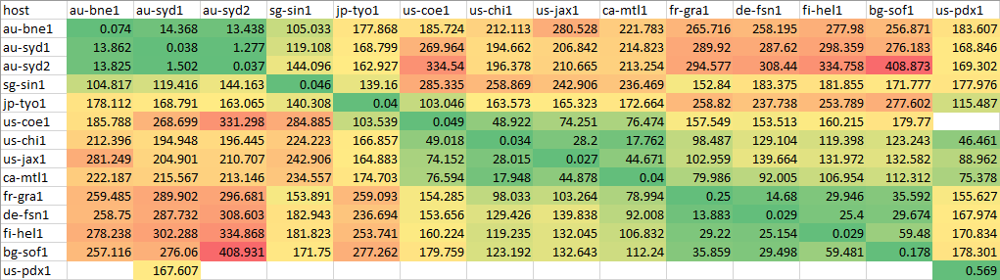

# Ansible Ping Matrix

Generate a ping matrix between hosts using Ansible!

This Ansible playbook instructs every host in your inventory to ping every other host, and record the average ping time. The results are then collated and saved in a CSV file on your control node.

This is called a ping matrix or a ping table, and can be useful for troubleshooting network issues or identifying problematic routes between your nodes. In my case, I use it to quickly identify the best peerings between my DN42 nodes.

## Requirements

- Ansible installed on the control node.
- Hosts file configured
- That's it!

## Usage

1. Update your inventory file (default `hosts.yml`) to include the hosts you want to ping.
2. Execute the playbook!

```bash
ansible-playbook ping_times.yml
```

### Command-line Arguments

You can set additional arguments using Ansible's `-e` flag:

- `domain`: Sets the search domain to use when resolving node hostnames. Defaults to the system's search domain.
- `ping_count`: The number of pings to use when averaging latency. Defaults to 8.

### Command Example

```bash
ansible-playbook ping_times.yml -e domain=mynetwork.dn42 -e ping_count=4
```

## Output & Example

The CSV file `ping_table.csv` will be created in the current working directory on the control node, containing the collated ping data in a tabular format. Each row represents the source host, and each column represents the destination host.

Below is a real-world example of the output from my DN42 network, using Excel's conditional formatting to automatically colour the cells based on the ping time:



In this example, `us-pdx1` is an IPv4-only node, and most of the nodes only have public IPv6 addresses, so only 1-way communication is possible, and most cells in `us-pdx1`'s row are blank. We can also see that `us-coe1` is unable to reach `us-pdx1` at all - indicating a routing or firewall issue!
